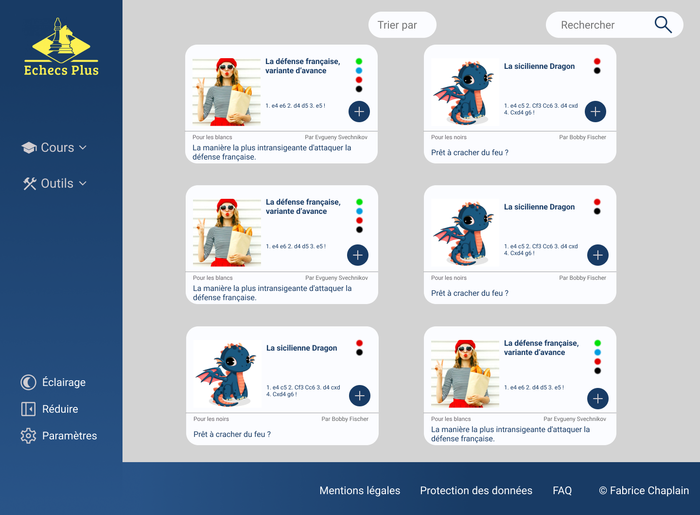
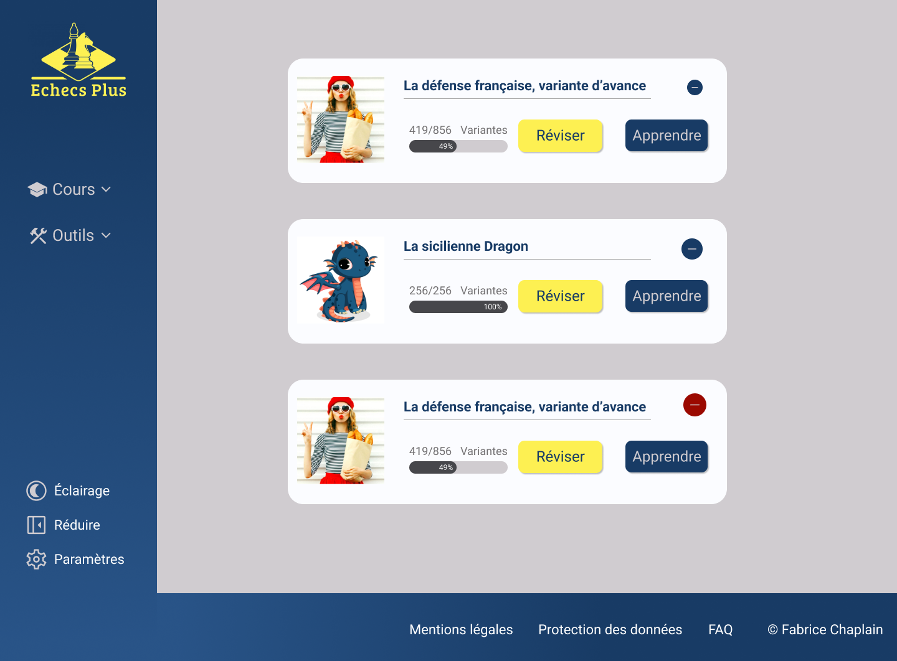

# Stage Echecs Plus

Réalisation d'un site web permettant de s'entraîner aux échecs.

L'utilisateur pourra apprendre et réviser les ouvertures de son choix ainsi que les finales théoriques.

# Stack Technique

React 
Symfony
MySQL
Twig
API Platform
Figma
Notion.so
Git
Github
Trello

# Maquettes

## Example de cours

## Liste des cours

## Dashboard

